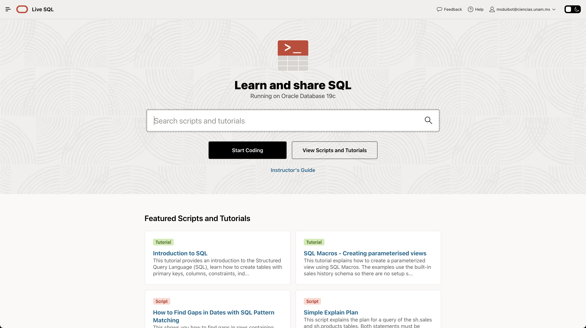
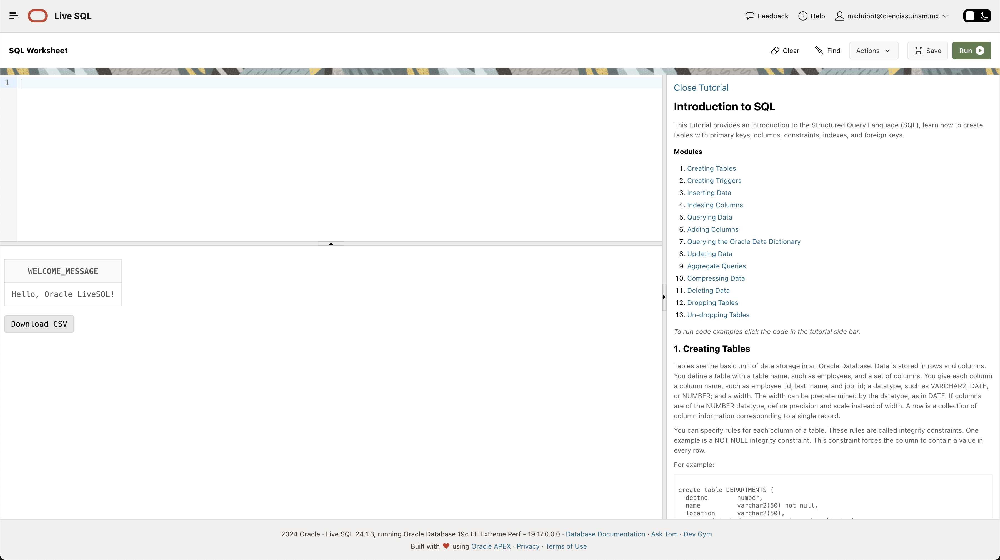
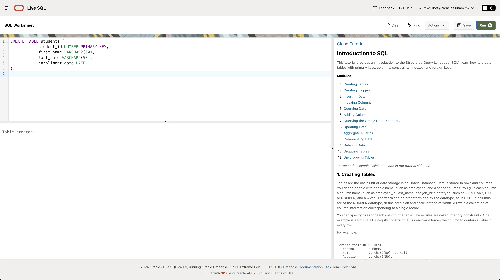
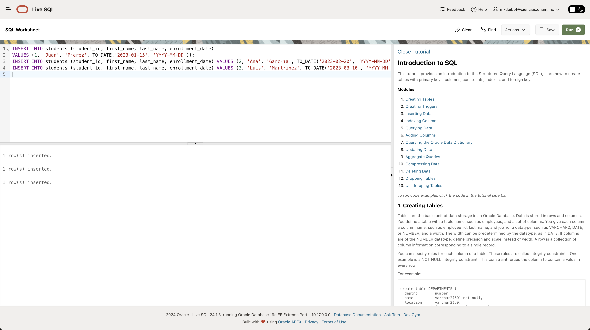
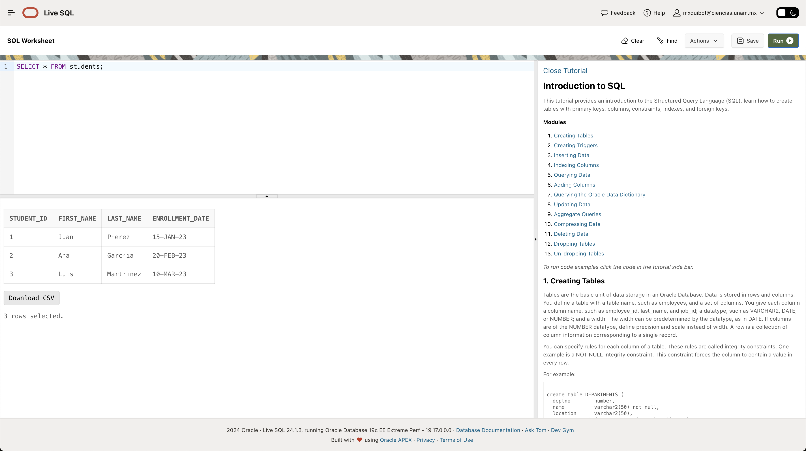

# Práctica 1: Configuración de Oracle LiveSQL

# David Rivera Morales - 320176876

# Introducción

Esta práctica está diseñada para familiarizarte con la plataforma Oracle LiveSQL, desde la instalación inicial hasta la configuración y primeros pasos en el entorno de Oracle LiveSQL.

# Objetivos

- Familiarizarse con la plataforma Oracle LiveSQL.
- Configurar una cuenta y entorno de trabajo en Oracle LiveSQL.
- Realizar las primeras consultas y operaciones básicas en la plataforma.

# Desarrollo

## Paso 1: Crear una Cuenta en Oracle LiveSQL

1. Visita el sitio web de [Oracle LiveSQL](https://livesql.oracle.com).
2. Haz clic en **Sign In** y luego en **Create Account**.
3. Completa el formulario de registro con tus datos personales y verifica tu dirección de correo electrónico.
4. Una vez registrado, inicia sesión en la plataforma.

**Captura de pantalla: Creación de la cuenta en Oracle LiveSQL**




## Paso 2: Ejecución de Consultas Básicas

1. En la sección **Worksheet**, escribe la siguiente consulta SQL para verificar la conexión con la base de datos:

   ```sql
   SELECT 'Hello, Oracle LiveSQL!' AS welcome_message FROM dual;
   ```

2. Haz clic en el botón **Run** para ejecutar la consulta.
3. Verifica que el resultado muestre el mensaje "Hello, Oracle LiveSQL!".

**Captura de pantalla: Ejecución de la consulta de bienvenida**



## Paso 3: Creación de una Tabla Simple

1. En la sección **Worksheet**, escribe la consulta para crear una tabla llamada `students`:

   ```sql
   CREATE TABLE students (
       student_id NUMBER PRIMARY KEY,
       first_name VARCHAR2(50),
       last_name VARCHAR2(50),
       enrollment_date DATE
   );
   ```

2. Ejecuta la consulta y verifica que la tabla se haya creado correctamente.

**Captura de pantalla: Creación de la tabla `students`**



## Paso 4: Inserción de Datos en la Tabla

1. Inserta algunos registros en la tabla `students` con la siguiente consulta:

   ```sql
   INSERT INTO students (student_id, first_name, last_name, enrollment_date)
   VALUES (1, 'Juan', 'Pérez', TO_DATE('2023-01-15', 'YYYY-MM-DD'));

   INSERT INTO students (student_id, first_name, last_name, enrollment_date)
   VALUES (2, 'Ana', 'García', TO_DATE('2023-02-20', 'YYYY-MM-DD'));

   INSERT INTO students (student_id, first_name, last_name, enrollment_date)
   VALUES (3, 'Luis', 'Martínez', TO_DATE('2023-03-10', 'YYYY-MM-DD'));
   ```

2. Ejecuta cada consulta y verifica que los registros se hayan insertado correctamente.

**Captura de pantalla: Inserción de datos en la tabla `students`**



## Paso 5: Consultar Datos en la Tabla

1. Realiza una consulta para visualizar los datos insertados en la tabla `students`:

   ```sql
   SELECT * FROM students;
   ```

2. Ejecuta la consulta y verifica los resultados.

**Captura de pantalla: Consulta de datos en la tabla `students`**


